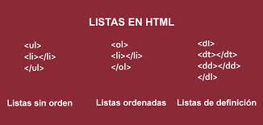

# LISTS

# Types of lists:
- Ordered lists :each item in the list is numbered,is created withthe ``<ol>`` element.
- Unordered lists :lists that begin with a bullet point, is created with the ``<ul>``element.
- Definition lists :set of terms along with the definitions for each of those terms, is created with the``<dl>``element

# Definition lists:
``<dt>`` This is used to contain the term being defined.

``<dd>`` This is used to contain the definition. 

## to add item in the list use ``<li>`` elemnet.

## You can put a second list inside an ``<li>`` element to create a sublist or nested list.

 

# BOXES
You can use <b>CSS</b> to control the dimensions of a box .
<b>pixels</b> have been the most popular ways to specify the size of a box .

## Limiting Width(min-width, max-width), to limit the width of a box on a page .

## LImiting Height(min-height, max-height),to limit the height of a page .

# here are elements and their function :

- <b>overflow</b> tells the browser what to do if the content contained within a box is larger than the box itself.
- <b>hidden</b> This property simply hides any extra content that does not fit in the box .
- <b>scroll</b> This property adds a scrollbar to the box so that users can scroll to see the missing content .
  
  # every box has three available properties to control its appearance :
- <b>Border:</b>separates the edge of one box from another.
- <b>Margin:</b>to create a gap between the borders of two adjacent boxes.
- <b>Padding:</b>the space between the border of a box and any content contained within it.

# BORDER WIDTH :

 control the width of a border, You can also specify different widths for the four border values in one property. like this ``border-width: 2px 1px 1px 2px`` The values here appear in clockwise order: top, right,bottom, left.

# BORDER STYLE :

You can control the style of a border using the border-style property .

# BORDER COLOR :

 You can specify the color of a border using either RGB values, hex codes or CSS color names .

# Shorthand :
The border property allows you to specify the width, style and color of a border in one property .

# The padding property allows :
you to specify how much space should appear between the content of an element and its border.

# The margin property controls  the gap between boxes .

# The display property allows :

you to turn an inline element into a block-level element or vice versa, and can also be used to hide an element from the page .

# The values display property can take are:
- <b>inline:</b> a block-level element to act like an inline element .
- <b>block:</b> an inline element to act like a block-level element.
- <b>inline-block:</b>  a block-level element to flow like an inline element, while retaining other features of a block-level element .
- <b>none:</b> This hides an element from the page . 

# visibility property :
 allows you to hide boxes from users,but It leaves a space where the element would have been .

# visibility property can take two values:
- <b>hidden:</b> This hides the element .
- <b>visible:</b> This shows the element .

#  border-image property :

 applies an image to the border of any box . 

## CSS3 has introduced the ability to create image borders and rounded borders .

# BASIC JAVA SCRIPT INSTRUCTOR : 
## Q: what is the array ?
A: special type of variable. It doesn't just store one value; it stores a list of values .

### when you create the array, you do not need to specify how many values it will hold . 

## Q: what is the array literal ?

 A: technique for <b>creating an array</b> .

### values in an array are accessed as if they are in a numbered list .  

### the numbering of this list starts at zero (not one) .

### Each item in an array is automatically given a number called an index .

# You create an <b>array</b> using the var keyword followed by the name of the array .

- The values are assigned to the array inside a pair of square brackets, and each value is separated by a comma.
  
- You can also use a method called i tern() to retrieve data from the array . 
  
- To retrieve the item on the list, the array name is specified along with the index number in square brackets . 

# decision and loops :

## THE IF ... ELSE statement checks a condition,if it resolves to true the first block execute,else second code run .

## SWITCH STATEMENTS :

-  starts with a variable called the switch value . 
- Each case indicates a possible value for this variable and the code that should run if the variable matches that value . 
- You have a default option that is run if none of the cases match . 
- If a match is found, that code is run; then the break statement stops .
  
### All values evaluate to either truthy or falsy . 

# Q: what is type coercion ?

  A: convert data types behind the scenes to complete an operation .

### <b>loops</b> check a condition,if it returns true a code block will run .

### code repeats until the condition return false .

# there are three types of loops :

- <b>for:</b> use when need to run code a specific number of times .
- <b>while:</b> use when you do notknow how many times the code should run . 
- <b>Do While:</b> it will always run the statements inside curly braces at least onceeven the condition evaluates to false .
  
 # To Create For Loop :
- delcare a counter and give it initial value .
- check the condition .
- update the counter value .
  
   

