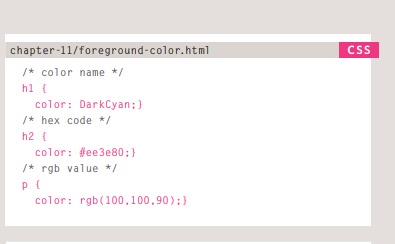

# IMAGE


## you add image to web site :  to include a logo, photograph, illustration, diagram, or chart .

# # Images should...
1. Be relevant
2. Convey information
3. Convey the right mood
4. Be instantly recognisable
5. Fit the color palette

# there is attributes when Adding images :
- To add an image into the page you need to use an ````element .
  1. This is an empty elemen ,no closing tag.
- <b>src:</b>
This tells the browser where it can find the image file. This will usually be a relative URL .

- <b>alt:</b>
This provides a text description of the image which describes the image if you cannot see it .

- <b>title:</b>
You can also use the title attribute with the ```` element to provide additional information about the image . 

- <b>height:</b>
This specifies the height of the image in pixels .

- <b>width:</b>
This specifies the width of the image in pixels .

# Q: Where to Place Images  in Your Code ?
1. before a paragraph .
2. inside the start of a paragraph .
3. in the middle of a paragraph . 

# Aligning Images Horizontally:
- <b>align:</b>
The align attribute was commonly used to indicate how the other parts of a page should flow around an image.
1. left.
2. right.

# Aligning Images Vertically :
- how the image should align vertically with the text that surrounds it:
1. <b>top:</b>
This aligns the first line of the surrounding text with the top of the image.
2. <b>middle:</b>
This aligns the first line of the surrounding text with the middle of the image.
3. <b>bottom:</b>
This aligns the first line of the surrounding text with the bottom of the image.

# Three Rules for Creating Images:
1. Save images in the right format .
2. Save images at the right size .
3. Use the correct resolution .

# Image Dimensions :
The images you use on your website should be saved at the same width and height that you want them to appear on the page.

# ``<figure>``
Images often come with captions,You can have more than one image inside the ``<figure>`` element .

# The ``<figcaption>`` element
been added to HTML5 in order to allow web page authors to add a caption to an image .


## Photographs are best saved as JPEGs; illustrations or logos that use flat colors are better saved as GIFs .

<br/>

# COLOR


# Every color on a computer screen is created by mixing amounts of red, green, and blue .

# The color property allows you to specify the color of text inside an element.

## You can specify any color in CSS in one of three ways:
1. <b>rgb</b> values : These express colors in terms of how much red, green and blue are used to make it up.
2. <b>hex</b>codes : These are six-digit codes that represent the amount of red, green and blue in a color, preceded by a pound or hash # sign .
3. <b>color</b> names There are 147 predefined color names that are recognized by browsers.

## Color pickers can help you find the color you want .

##  the background-color property sets the color of the background for that box.

# Contrast:
1. Low contrast .
2. High Contrast .
3. Medium Contrast .

## opacity property : 
allows you to specify the opacity of an element and any of its child elements, The value is a number between 0.0 and 1.0 

## the rgba property allows you to specify a color .

# HSL Colors :
1. Hue : the colloquial idea of color.
2. Saturation : the amount of gray in a color. 
3. Lightness : the amount of white (lightness) or black(darkness) in a color.

<br/>

# TEXT

## There are properties to control the choice of font, size, weight, style, and spacing .

# Typeface Terminology :

- <b>Serif:</b> fonts have extra details on the ends of the main strokes of the letters.
 
- <b>Sans-serif:</b> fonts have straight ends to letters, and therefore have a much cleaner design.

-<b>Monospace:</b>Every letter in a monospace font is the same width.

# Techniques That Offer a Wider Choice of Typefaces:
1. font-family .
2. font-face .
3. Service-based Font-Face .

# Specifying Typefaces:
- The <b>font-family</b> property allows you to specify the typeface that should be used for any text inside the element(s) to which a CSS rule applies .

# The font-size property enables you to specify a size for the font. There are several ways to specify the size of a font. The most common are:
1. pixels .
2. percentages .
3. ems .


## @font-face allows you to use a font, even if it is not installed on the computer of the person browsing .

## The font-weight property allows you to create bold text,There are two values that this property commonly takes:
1. <b>normal:</b>This causes text to appear at a normal weight.
2. <b>bold:</b>This causes text to appear bold.

# font-style property,There are three values this property can take :
1. <b>normal</b> This causes text to appear in a normal style .
2. <b>italic</b> This causes text to appear italic.
3. <b>oblique</b> This causes text to appear oblique.

# The text-transform property is used to change the case of text giving it one of the following values:
1. <b>uppercase</b> This causes the text to appear uppercase.
2. <b>lowercase</b> This causes the text to appear lowercase.
3. <b>capitalize</b> This causes the first letter of each word to appear capitalized.

# The text-decoration property allows you to specify the following values:
1. <b>none:</b> This removes any decoration already applied to the text.
2. <b>underline:</b> This adds a line underneath the text.
3. <b>overline:</b>  This adds a line over the top of the text.
4. <b>line-through:</b> This adds a line through words.
5. <b>blink:</b> This animates the text to make it flash on and off.


# The text-align property allows you to control the alignment of text. The property can take one of four values :
1. <b>left:</b> This indicates that the text should be left-aligned.
2. <b>right:</b> This indicates that the text should be right-aligned.
3. <b>center:</b> This allows you to center text.
4. <b>justify:</b> This indicates that every line in a paragraph, except the last line, should be set to take up the full width of the containing box.

## a set of attribute selectors that allow you to create rules that apply to elements that have an attribute with a specific value.


 


