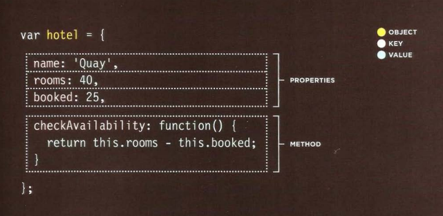
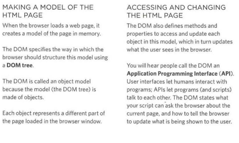
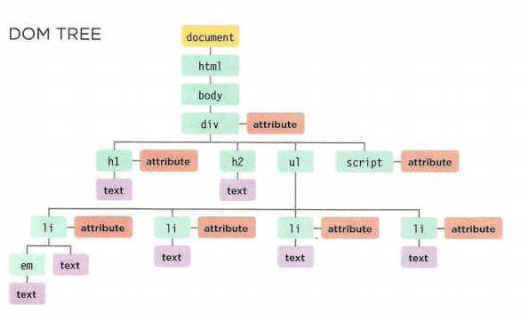
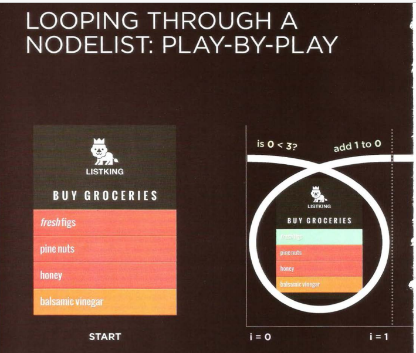

![](data:image/jpeg;base64,/9j/4AAQSkZJRgABAQAAAQABAAD/2wCEAAkGBxATERUTEhMVFhUXFhcbGRcVGBYaHhseIBsYGRsaGh8YICggGh8mHxsYLTIhJSkrLi4uHSAzODMsNygtLisBCgoKDg0OGhAQGy4lICYtLS0yNS8tLy0tLzItLS8tLS0tLS0tLS0vLS0tLS0tKy0tLS0vLS0tLS0tLS0tLS0tLf/AABEIAJkBSQMBEQACEQEDEQH/xAAbAAEAAwEBAQEAAAAAAAAAAAAAAwQFBgIBB//EAEwQAAIBAwIDBQIJCAcGBgMAAAECEQADBBIhBTFBBhMiUWEycRQVFiNScoGRsTVCVJKTobTSBzNTlMHR0zRic7Ph8CRDVWNksnSCov/EABoBAQADAQEBAAAAAAAAAAAAAAABAgMEBQb/xAAzEQACAgEDAgIJBAICAwAAAAAAAQIDEQQhMRJBE1EFFGFxgZGh0fAiMrHBFeFCYlKi8f/aAAwDAQACEQMRAD8A/DaAUBppwO+cY5QA7pTBMieYXlz5kVg9TWrfCz+o1VM3DxMbEmV2dyraWnZNrxUIJEksJAI6VWGrqnKUYvePJMqJxSbXJYHZHL1XF0rNoKX8awJBI384E/dVPX6MRef3cFvVbMtY45MGuw5z5QF88Iv9x8I0fMzGuV5zp5TPP0rLx6/E8LP6vI08KfR142PXBOD3cq53dqNWkt4jAgQP8RVdRqIUQ658E1VStl0xKmZjtbuNbaJRipjcSDBitYSU4qS7lJR6W0yKrFToMLsZm3ba3ERSrCRLqDH21w2ekdPXJwlLdew6YaS2cVJLZmRxHAu2HNu6hRh0P4gjYj1FdVdsLY9UHlGE4Sg8SWCrWhUUAoBQCgFAKAUBf4Zwi/kau5QvoALbqImY9ojyNY26iurHW8Z4NIVTnnpXBSA32rYzOktdhs829fdgbToLAN93Q+hNee/SmmUunq+x1rRXOOcGdwvs/k3+87tf6r29RCxz2367Gui3VVVdPU+eDGuic84XBRw8ZrtxLae07BR7yYFbTmoRcnwtykYuTSRZ43wi7i3O7u6dWkN4TIgzH4Vnp743w64cF7apVy6ZGfWxkKAv3+EX0srfZItOQFYld5mNpnoelZRvrlN1p7o0dU1FTa2Z74NwW/lMy2VBKiTJA2mOtVv1NdCTseCaqZ2vESzb7L5ZyGxwg7xVDHxCIMQZ5dRWb1tKqVrezLrTWObhjcpcY4Vdxrnd3QA2kNAIOxmOXurWm+F0eqHBnZVKt9MijWxmaHBuEXslylkAsF1GSBtIHM+8VjfqK6I9U3hGlVUrHiJTv2ijMp5qSDHmDBrWLUkmijWHhlvhHCruTc7u0AWgncgbCPP3is7r4Ux65vCL11Ssl0x5IbmHcF02Ylw5SF3lgdMCOe9XU4uHX2xkr0vq6e5s53YzNtWjdZF0qJYKwJUcySB5ek1x1+kdPZPoi9/5OiejtjHqaOeruOU+UAoBQCgP0nsDji/w+7Yb2e+393gY/ga+f9J2OnVQsXl9z1tFFWUyg/M6I37N+1bySQLdi5dceRCd5bB/A15/ROmyVK5kkvnhnVmNkVZ2i39NjB4HxEjAy8y4oY3bjnSeREKgU+m5Huru1NOdVVRB46Uc1NmKZ2y7sn4/wRLmRiKmPa1aXa4PYXSNAhtIk+I7CP8AGq6XVShVa5zeM4Xd9+Cb6FKcFGK832RYzMXFfFyS1uwVtC4B3VsroKrMaj7RBjdYHSs4WXQvrScv1Y5fOfZ2LyhXKqbwtvJcFDtVxBbXDbKdyg75BCRskrqLKI9oE/ea20VLnrJy6n+n6mepsUdPFY5+hlf0ZYVtmyLlxFYIijxAEb6ief1a6vS9s4qEIPDbMNBCL6pSXCNrszbxXx0CLYF9yS63rcl9yWCyQY3EESB5VyayV0LW5dXQuOl8e/8A2b6dVyrSWOr2o4HtLjm3lXUKLbIb2EJKiQD4Z3gzMdJ6V7elmp0xknn2vk82+PTY01g7ztZbyEx8PHxteuVEpO2lQviI5CW6+VeJoXXK6623GPb+ew9LUqca64QNnifCrGRl2hdAY2rTMVPXUyhZ8xs+1clN9lOnk4bdUsL8+R0WVQstSl2X5/ZhX8Wxm4Ny61q3ZYXStp0XTtqVVnzmSCK7Y2WabUxgpOSay8+7JzSjC6lyaS32J+JjFxWTFXC75DaLMUTU/PSCT9hkztIqlDu1Kdzt6XnC32LWKulqtQysfEpnhNj4BjBbSlr99AGKgvpZ2fc89kEGtlqLPWrMy2jF+7OMfyZ+FDwIbbt/TP2NVOEYzcQde5td3bx1ldCxqZyZIjnpWuV6m5aRPqfVKXOex0eFDx2sLCRDa+DHFxbvwSyGuXkVE0jbUxEnz8O++079Ku/GV9kPEeFFt/Bfcouh1wl0Ldnpuz+Lc4k5NtdNuzbYoAApdi+5A29kDb3VVay6Gjjh7ttZ74J9XrlqHtsktijx7Hxb+IzDuu81xaezbdR7QAQmIJ3g/ZXTpnfVek89ON02n8TK5Vzr7ZzthG2mHiplpjrjWf6hnZtCyAGCjp1PWuB23S08rXN/uwtzpUIK1Q6VwUODZNqxi5t1LKBUvXgNvbAPhB25eKB5b1vqa5231QlJ5aT935gzplGFU5JcNnGdjwl3iVssqgF3YKBsCFZlA9xiPdXsa9yhpZYe+Dz9KlK9Z8zuLL5D8YcHWLNu0I56TKqfcTqY/q+leJJVR9Hrjqb+PJ6Sc3qn5JHsX0tWuIZAUMDccR0bSioQY6Fy1HCU7KKm8PH95/gjqUYWzXmR5XCbL38FzZto5DM6KABAtyQR10sVH21aGosjXclJtLh/H7ESqhKdbxh9/kecbhmKb2ZkutuLT6FDiUTRbQliB6nn6GrWX3KuqpN5ksvHLyyI1Vuc7H22+hV4jwjDyXxNkDu/jNpHtrcUW3cxI/3QJmfFWtd99EbX2S2y02nlL+yk6qrHDzfOFjJB2gy8ZfhFg4E27WkLctIBpOnVLMPZEx5yJnnVtJVbJQt8Xd8p/wBIrfKC6oeHsu6JP6Qs9beLZsdynziyNtrenR7Ajb2mHuqnoupzvnZ1PZ/PnktrbFGuMMc/Qz/6P27rGy8g9Aqj37/4stdHpNeJbVV7zLRPohOfuO3vKiZKlf6y+QCfJLas0/eVH/7DyrxYuU6Gn+2Gfm2ei8RsTXMv4RiZFizrzc24i3WtEoituBoRZ28yxO/Su2M7OmnTxeFLdvvu3/RzOMc2XNZxsvgRZnALGT8CuNbW29yDcVBpDDuzcIj3gDzhqvXq7afGinlR4z78ETohZ4cmsZ5+Rp8NyLa3crTZt20x1VQyqAT4S7Ax0ECuW2E5Qq6ptubzh+/CNq5RUp4ikolDh/DsfHx7DN3PeXihd7yFy5YamVI5HeB+BrosutvunFZxHOMPGPazKFdddcW8ZfnuScCwMe3n5FyyNKCykrDKFLElgAwEbID9tV1Vls9NXCzlv38f/SaIQjdOUOEj8wXPuC8byMVfUzAjoTP+dfR+FFw8N7rGDyOtqXUuTuuJcXGFjMhNy5k5Kku7qVUEgKYDAchyAHTfoK8avTPU3KWyhDZJbnozu8GvG7lLnJ+dV7p5YoBQCgFAa3Ce0GRjo9u0wAuc5AJ5ESD051z3aWq6SlNcG1d8601F8hO0OQMX4KGAtb8hvu2oiffUPSVO7xsfqHjzVfh52CdoL4xhjeHugQY0iT4te5670ekrdvjf8vxDx59Hh9i43bTMN9b+pdSqUjSNJBMmR7439Ky/x1HhuvGzeeTT1u3r687jN7ZZl23ctsU0XJkBAIBjYeXL8aV+jqISjNLde0iertlFxb2ZDm9qcm7jDGcqUAUTp8RCxAJn0HSr16Kqu12x5fyInqZyh0Pgg4Zx+/YtXLVsqFuTqkSdxp2PTar26Wu2cZzW64KwvnCLjHuaGD23zLdtbYKMFEKXWSBy2M/jWFno2iyTk8784ezNIay2KS8jDyM25cuG7cbU5bUSep/y9K7I1xhDoisI55TcpdT5Ohb+kDPj2kHuQVwf4nTZ4fzOr1+7z+hlYvaHKS+cgXCbh9otvI8iOUbDbp0rqnpKZ1+E47GMb7Iz687k3Gu1OVkqEdgqAzptjSCfM9TVNPoaaH1RW/t3LW6myxYfBauduM42u71jlGsL449/n6xNZL0Zp1Prx8O3yLPW3OPTk84fbXMt2ktKywkAEqJgcgfSpn6N085uclu/aI6y2MVFPgjXtflh7zgrqvBQx0jkoKiPLmas9BS4xjjaPG5HrVmZPz5PK9qskLZWUiwQUGkcwpUT57E1Z6GnM3j93O5HrM8RXlweE7UZQyWyQ4FxgA2w0kAAAEfYKPRUupUtbIhamxWeJncl4j2uy7xQsVCowcIqwpYGQSOu/nUVaCmvOFysZ74JnqrJ4z2Pads8sXjflNbIEJ0CNIMwB7zVX6Podarxsnnkn1uzr6+5FwntXlY9t7aFSrEk6hJBPMjerXaGm2SnJbryIr1NkIuK7mNZvMjBlJVlIII5gjqK65RUlh8GCbTyjo7/AG7zmt6NaiRBdVAb7+QPqAK8+PovTRn1Y+x1S11zjjJV4Z2ryrCIltl0Lq8LKCG1GTq89+VbXaGm2TlJbvH08ilepsgsLg6HgfayzrbKy7jtfAZEtovhCeE+HoCSDuTXBqfR83FU0pKPLb5ydVOrjnxLHl+Rz2D2qybN27ctkRdZmZGGpZJJ/wAY2rus0NVkIxl/x4a2Zyw1M4Sbj3IuIdpsq7dS61yGtmUCCAvuH+c+XKrVaOmuDgls+c9yJ6iyclJvgscW7YZeRb7p2UKfa0LGr3n/AAFZ0ejqKZ9cVv7exazV2WR6XwR8W7U5ORZWzdKlVIMhYJIECTMfcBV6NFVTNzhyytmpnZFRl2KdnjF1cZ8YEd27am23nw9fLwitZUQlarXytiitkoOC4ZofLDL74X9Slxb0CVEATJ28/WsP8fR4brxs3k19bt6+vO+MEfDe1OVYe4yMp71izqyypYmSY6Va7Q02xipLjjHJFepsg213POT2py3vpfZ/Hb9gAAKoPMR69ZpDQ0wrdaWz59pEtTZKam3ui1mdtsy4lxGKBbilSAgGxEGOvKs4ejKISjJJ5XG5eWstkmn3PPDe2eZZti0pVlX2dayV8gD6es1Nvo6i2fW08vnDxkV6uyEelEGN2pykF6HBN6dbMASdtOx6QOQ6VeWipk47ft4KLU2LO/PJj23gg+RB3rqaysGKeC/xzjd7KcPeIJVdIgQIkn/GsdPpq6IuMF7TS26VrzIza3MhQCgFAKAUAoBQCgJEsOVZgrFVjUwBhZ2EnkJ6TU4Ickmk3uy78Q5kE/Br8CZPdXIEc526VPRLyMvWac46180QNw6+GZTauBlXWylGlV56iI2WOvKo6X5FldW0n1LDeOe/l7yO5i3FfQyMHkDSVIaTyEHfeRTD4LKcWupPY95mDetEC7be2SJAdWUkeY1Cji1yRC2FizCSfueSvFQXFAKA9WrTMQqgkkwABJPuA50W5DaSyzyRQk+UAoBQHV9pMG0nC+F3FRVe6uX3jAbvpvlV1HrA2FAcpQGhicFyLtprtu2WRSwJBWfCAzQJkwCCYFYz1FcJqEnhmkapyXUlsUK2MxFAKAUBM+JcCoxU6XnQY9qDBjz3qqnFtrPHJPS8ZL97s5loYayw8LtuV5INTzvsQOanf0rGOrplxLyXz4NHTNdjPOM2gXNtJYqN1mQAT4ZkcxvEVt1Lq6e5njbJ4tWmZgqiWYgADqTsBUtqKywlnZFqzwq+3e6bZPcgm5y8ABgz9vlWcrq49OX+7j2llCTzhccnjM4ddtC21xCouLrSY8S+e1TC2E21F5w8P3kShKOMrk82cK46XLiiVthS5kbajpGxMnfyqZTjGSi3u+AotpvyFvDuNbe6B4EZVYyNi2rSI5mdJ+6jnFSUXy/6HS8dRex+zeW66ktFhpVoBWYbUV2JkkhSQBuRB6ispaqqDxKWP9cl1TNrKRCnBck2jeFpu7Ey3oDDGOZAOxIECrO+tT6HLcr4csdWNj2/AMoPctm0wa3b7xwY8KQDqmYI3HKo9Zq6VJS2bwvf5E+FPLWONynm4j2na24hlO45+oII2IIggjmDWsJqcepcFJRcXhkFWIFAKAUAoBQCgFAKAUBu8D4rbs4+SrKrtc7nSjhip0sxadJERI61rCajGS88HFqdPOy6uSeEurLXO6L/ABzjVi58P0MT3z45t+FhISdXPlE9a0ssjLrx3wc2m0llao6l+1ST+PBs8R7V4bi+VZtdyzctatLbp3blBy2m48e5BWkr4vL7tY+n3OOn0bfHoTSwpKXPfqWfos/EwePZeM+YuTbvBgblsldDgqFCgkyIPLpWNkoufUmehparY6d0yjjZ91vnJqvx7DDsvea9VzKupda0StlrmnQArCWiCTtzI2NaOyGce/4ZOOOj1HSpYxhQi0nvJR53XHs9iPORx7h8MbYVR3hLIbCk3d7ZVlP/AJYGl9p2nkZqHZX2/jkvDS6pYUnnbnq452fn2+5Nc49gJ/VsjHWxk2ejZKXCIZelvUPs26VZ2Vrj+Pb9jNaTVz/ftt/5eUGu3/bDPWL2h4dr1MqagLiq3cgAKLxKKQEPO3AmJ6EiZora85f5v9hPR6vpxFvt3/64b5/8t+T5idp8JGtkBVVO4KgWhKkXLne7xJ+bYDn7t6RugsfD+d/oLdBqJxkm856u/bpWP/Y4bPcNduMGDS7HUBEyTvG0T5VyS5PcqWIJYxsivUFxQCgOz7V/kfg/1c3+INAcZQHUdnuPWLFm3rFw3LV67dVVC6W1W1QBmJlRI32O1cGo01lk3jGGkvbs2zpqujGKzym39DQsdrsdVtArdOkIAulIs6bL2i1nfxEswfeNx571jLQ2Ny3W+fPfMk9/hsaLUQWNv9bY2PLdqcYo4Y32fTfVWZbfj7yzbt6n0sNJDIeQOxEkmSZ9Tt6k1hLbu9sNvb5hXw757+Xck4l20t3BdX50q4ywFYCIcJ3IO/JSGPpO1Vq9Hyg4vbK6fpnPzE9SpZXv+vBNmduLJLNbFxDphdKwUm5ZYpqNxpUBGjSFAnluarD0dNJKTz5+3Z78Lz9vvJlqo9l+fMyuM9pkuGy1vvPmci7cCPAUqbveJyJggbRG3nXRRo5QUlLH6opZ77LD+5lZcnhrs2/rkuWO1OLbLhO/AuXMi6X0pqRrltkUINUNBYnUSJgbVjLQ2zS6sbKK74aTzvsaLUQjxnfL+aLzdqMZQt0ye8a8BBBuL81j2++dbbqVZmtvsGUwxIPnl6la30+SXue8njdPzXZl/Hgl1e/39tyi/bG1AK96hF0uUtoio83lua2lmKsFBED9aJFbLQT3Tw9sZbba2xjhbfmDN6hcrbf+8lbB7S2bd/LuN3lxL7L7QElC/wA4reIx82WA3PTlV7NHOddcVhOK+uNvqVhfGMpPzNAdtMcspi6kLpDoqllVb5uLbEsPC1vSp35jkRWX+PsS5T+7jjPwe6NPWYv89uf42PlrtlihAO6cDVbPcAL3Y05BulgZ5spA9nmvlUvQWOWcrvv33jj6P2hamGOPh25yZ/aHtJav2rqKGJY2IYqVnQbxOrVcck/OKAZ6dIFa6bRyrnGTfGe/njjZeRS2+MotL2fnctfHuKDqdnIZsO8otBSQbKFGttLDQdQ5wdoPUVn6ra1hY26lv/2ec+0t4sO/sfy7FW92msuDdZXF7uL9kIoXuyLrXDqJmRAuNtBkgGRWi0c4/oTXTmLz32xt9Crvi/1PnDXs3NLO7aY796AlwNcS4mo6d1KP3YO+0PdefRVrnh6Osj05awmn8crP0X8mktVF5252+mxy3aS+jXVCEMLdmzbLLuGKIqsQeokEA9QAa9HTQcYNvu2/mzltab27JIya6DIUAoBQCgFAKA1bHA7j6IK+NlVefNjA5b8wf+yJqpb4Jawuo0D2IzoB7vmSI1LOwB845Ex9VvKpyQek7C5xIhFIJAkMI6b85gTvt0PlUvYGevALps9/K93r0TO+rTq5c4jryqMgqfAW8x++pA+AN5j99APgDeY/fQD4A3mP30A+At5j99APgLeY/fQD4A3mP30A+AN5j99APgDeY/fQD4AfMfvoAOHt5j99AWM/gr2lUsRJDGPKPXkff6GjWCE8m/2q/I/B/q5v8QaEnGUAoBQCgFAKA3MXs4Ws27z5GPaW5r0C61wE6TpJ8KMOfrQHr5PJ+n4X617/AEqAfJ5P0/C/Wvf6VAPk6n6fhfrXv9KgHydT9Pwv1r3+lQFXjPBWx1tP3lq6l0MVa0WI8J0sDqVTz9KAzKA+UB9mgPlAKAUAoBQCgFAKAUAoDobXIe4VUE7l10+I7iRBPmR+IoCWzjXWQuPZDafa/OImPu6n/OheutzbS954bDYbkCN9/cCff0oay0tkU2+CHKw2tuyPsykgjY7/AGUyc5F3XrTIHdetMgd160yB3XrTIHdetMgd160yB3XrTIHdetMgd160yB3frTIPmXJVizMTB3Yk9PWpyDV7Vfkfg/1c3+INSDjKAUAoBQCgFAdf8LSzZ4TdcEpbuXXYAAkhcgMQAdjsDzoDUyu1vCrpY3se5ebSQbj27Ye4CcgqpIcm1o7ywBcBZiLUGBtQHqx2m4GHDPiMwDsYGNZUFS1khSO9IBVUcT+drJ2kyB8xe1XBoU3MEFwq7ixa0zpthyVFxdQLK8biA0iDQFTN7U8PONfs2cbumuWgisLNnoMQjUdUzrt5J1bka0O8QoGPxv8AJ/D/AHZP/NoDnqAUAoBQCgFAKAUAoBQCgFAKA6G3yHuH4VUE10AaYM+Hf0Mnb7o/60B4IoCXFRCTrfQApIMEyQNl25T50LR5WT73FvpcAEfRO3pQ38Kpv9/0GTaQBdD6iQdQgjTuQN+sjf0oYTST2IKFRQCgFAKAUAoBQCgI8n2G+qfwoganav8AI/B/q5v8QasDjKAUAoBQCgFAamD2izbKC3aybyICSFR2AE84ANAT/K7iX6ZkftH/AM6AvcD7VcQbIRWy75UkyDcbyPrQFH5XcS/TMj9o/wDnQD5XcS/TMj9o/wDnQFDiXFcjIIN+9culRC94xaBzgTyoCnQCgFAKAUAoBQCgFAKAUAoBQHQ2+Q9w/CqglciBA5Df1Mn/AAj7qA8nlQCaALAIkGNiQDBI9CQYkcjB9xoGTvctapCnTJgb8tcxux/Ngc/tNDeMq1jK/M/Y+2XtSutWIETG07mY32MRvvHODyIrJ1uOEty1xTIxHtjubTW7kxuzER4jrMyJ9kQD9LyBYZMtPxHAkxitHjgFjIllKmQ35qhhHWR76EIq4mTiC5dNy07W2J7sAwyAkkCdXMArvvOn1NCT3av4E+KzeI22DRvLTvq5QVjqIO7TNCCQZXDgZGPdIlYDOfPxTDCdpjfoPUkSUWu2NAAQ6jp1T0hWBIOr85yDG0BAN92ItBxUv1LKIdaeXQ//AFA8/pSftoaqdXl+Y++59vtaKjQrBtTSSdtMDSI33nVuI5gQedDKbi5fp4KmT7DfVP4URU1O1f5H4P8AVzf4g1YHGUAoC1i4Fy4pZdIUEAl3RBJkgeMieR5UBJ8VXPpWf29j+egHxVc+lZ/b2P56AfFVz6Vn9vY/noDY7G8NccQxCTaIGRaO16w3568gHk+4UBodl+OcSyrr2znXU02L1wMW2m3bZwGJ5AxuelAdcmPki4ts8RzCxyMSzqQoVm/Z7/UOpAAI9dqAg4rw/idrFe8vEMi7cAulUt+KVF3GS220nx2r4f0BX1oDluA9oM7Ia/ZvZDupxcnw3GAWRaYidUAQepoDmfiq59Kz+3sfz0A+Krn0rP7ex/PQD4qufSs/t7H89AQZeI9sgNG4kFWVgRJEgqSOYP3UBBQCgFAKAUAoBQCgFAKA6G3yHuH4VUFjIdjp1CIQAe7cj8TQER5UBJj3tJJgGVZSD5MIMEbqY6g9SNwSCBLfz3dmZgpJJPLlJmB5AcgOgA8qG8b5Rj04R8Oa2llhYbnty3BkbwDtziYJE7mRWy5zwmkvcVqGQoBQCgFAKAUAoBQEeT7DfVP4UQNTtX+R+D/Vzf4g1YHGUAoDRt/7G/8Ax7f/ANLtAZ1AKAUBe4FxD4Pk2b+nX3VxH0zp1aWBiYMTHODQF9Mvhg5WM0SCNsuyNjsR/s3KgJPjLh/Pus7mD/tlrmBAP+zcwNhQHuzxfBT2Leev1cy2OgHTH8lX7h5UB5scXwbQuGzj5PePau2wbmRbZRrUoSQthSYnzFAc7QCgFAaPFfYx/wDgD/mXaAzqAUAoBQCgFAKAUAoBQHQ2+Q9w/CqgnvoRpkz4QRHSd4/76zQEZ5UBLi2NZI1KsKzeIxMCYHmfT3nkDQmKy0j2MMz7S9ev/f8A0qDpWlbeMo8ZGMUCklTqB2B3EMV8Q6bjY8iOVDnlHpbTIakqKAUAoBQCgFAKAUBHk+w31T+FEDU7Vfkfg/1c3+INWBSyuGcPsi0L1zKLvZtXD3aWio1qGganB2mgPl7B4agQsc4C4upCbVnxDUyyPHv4lYfZQHux8Wsncqc067ikfNWZLAFQB85/vfhQEORi8LR2R2zlZWKspt2JBBgg+PoaAzu0HD1x8m9ZViwtuyhiACQDsSByNAZ1AKAUAoBQCgFAdCvD8C3Yx3yLmTrvW2uRaS2VAF27aAlmBJ+bnl1oCS7g8NVEuMc4I5YIxt2IYrGqPnOkj76Amezw+6mofDSthAGItWfCC5gt859J4+6gKZt8J+nm/s7H89AUu0GAlm/otszIbdl1LgBouWrd0AgEiRrjY9KAzaAUAoBQCgFAKAUB0NvkPcPwqoJbmnaPLf37/wCEUB5PKgHSoASJEyBImACY6kAkSfSR7xUgtFMfXGptGqJ3nTqG/s89M9OY5bxQ2fhdPfOPrn7F4WuHEL87eUwuqUn80ajABjedpPTmN6GJ8Nrh/hHe3eQ1MFaSfnZgFdIAHc7b9YPMkiD5mYuGjEJda4AG9zeGFgqNvGZMkQqxuTsLLGdyjps+LdvZOmBMnw6QZHL25M9Ad+RGlir/AOH55FahkKAUAoBQEeT7DfVP4UQNTtV+R+D/AFc3+INWB8472fysj4Pcs29afBMYSGTmLagjc9DQHRcDz+KY9q1a+BaltIFWb1vwmcrVcQNKq5GREwf6tZkbUBpjtFxLSB8XHZ3JZb9tTLFmOkhfATKzGxAIAGrYDgeK9meI3r928cfT3lx3067ZjUxaPa3iaApdtyDxDKgg/PPuDPX0oDDoBQCgFAKAUAoDq8ngWTkY2E1hA4XHdWh0EN8KymghiDyZT9ooDpuz2XxLFxrdgYWvu3Zpa/bCnVct3CdAO1wd2Arz4dTbGaA1cHjmeCFuYTLbLIGIv2rhe2Da1C4rMBduOtsq1wkbOdtqA4TjPZ7iWRfu33seK47MR3lraTsB4uQED7KAodskK5WkxK2MRWggwy41lWEjbYgj7KAw6AUAoBQCgFAKAUB0NvkPcPwqoLGQfZ8GnwDpGr/e5CZ86AiPKgA5UB9tkSJEiRIkiR1EjcT6b0BPdyEJMWwAWJieQJBjYdAI+2hurIdKXT/su8PxiBqayHBIYAvEABvQyNxz+jv1qk4Slw8GE93tsWsfBvLdE4wK+13XUkT4pKltP+77O3KpcG0MkTY0gjuFnTp1awT/AFQQHcEA6vHIg+yARuTHRLzJbRHk8OvtANoC4pfWRCk8tiigBdIB6TuZ5Cr4wQUsnh9xE1sBp1KvMc2DkfuRvupgFWgFAKAUBHk+w31T+FEDU7Vfkfg/1c3+INWBkWeyWayK4trpdQy6rtlSQRIMM4O4oD38js7+zT9vj/z0Bd+SmZ8G0aLervdUd9Y5aY+n50BS+R2d/Zp+3x/56Ax87EuWrjWri6XRirLtsRzG21AQUBo8J4JkZIc2UBCadRZ7aAap0iXYCTpb7qA6C32XylS2qYti4+k6pvWyxbU0ABbwnw6dgKApcLwL+Qhe1iY5RW0lmfQJiY+cuiTHlQFv5P5f6Jift7f+vQE2P2dyIfXiYkhPD8/b3bUv/v8AlqoCH5P5f6Jift7f+vQD5PZm8YeKYBMLeQnYSYAvydgeVAU+F4N/IRntYmOVVgpZn0CSCQPnLokwDyoC+/BM0hVOJiQoIHz9raSSf/P8yaAr8T7I5LMDbtWVBRNQW/YgNHijVcJ50BU+Rud9C3/eMb/UoD6vYvPOwtoT5LfxyT12AeT9lAc/QCgFAKAUAoBQHR46FtKjmdIH2wKqCzmNci3rMgINO/JeY/H7ooCueVAByoD7bUkgAEkkAAbkk7AAdSTQE7YNwRIG5YcweTFJ22jUGAImdLULwqlPPSa+Nxm+iIwt7WVtqGldhvoMRymdz1gTyFTkvLrhDpfD3PFztNcZtRWTpKjxDYEEEAaYHM/aSedMmGCbM7W3LqBHtrAaZBjoVAgDTyPl+Jlkk83e1dxplBvPUDmVYxA6lR+/zpkmL6XkpcS4016ytorAW4rgzMQt0Echz7yZn831qMkyk5NyZl0KigFAKAjyfYb6p/CiBqdqvyPwf6ub/EGrAy+2Ht4//wCHi/8AKWgL3ZNuHfBb/wAJW33ylimstLL8GyQFUQRPe91vzGoEEaaA6DjWNwB1ulXVCiXjaWyTDTdyGQksPE2nuBpPRiOkqB+ZUBuduPyhlf8AFb8aAw6A7TsC+OLd05IU2Rfsaw/L+pzNM7H87T9sUBr8Dt8NXJtLjaS4zbBRpcsbbWGa4pnwwtwhZgHYTPOgM7sccEYiHOnuRmyQAxBItjZtILRGrl1jkJNAR334Gbtog3AjLdF4hT4fABb7sERJJJ9CKAzONtwwvfNnvNhZFgJPdkhEF3X3gFw+IPB2JoDYw8ngj4479e7vXIDi0tz5v5xVlNUiBb8UaiWIYbSBQHzs/nYhy7C49hF1W7gYt3hdCrZBUgloLNbNvUYI8gtAeexxwvgc5s9yM1CY1QSLNwgNpBaOfIc45CSAIbj8F7yyR3mkpdF6AfCe5It92CIJNwjfoUnrQFHjh4WXv9z3ghbIsd37BItoLpfvAH9oNvAmgNbCyeCPjfPp3V64yhxaW6Rb8eklJkR3cP7RJbUNhAoC/wADzcD4ZhpiWrJLF9TabwuW4kop1HSW0+0wkEkwFAWQPzagFAKAUAoBQCgOkxBum+n2fF5ct/sqoPd4ez4pld9wY3O2xPv+2gPB5UAHKgPkA7EgA7EmSAPMwCSPcCfQ0BdyB4jN7UZI1FugYQZk85J5nqZPMjojBKKanh+8+YlhXkPdCgMu7EAEQ8sATuenpr9aznJrhZMJtp+Z7x8SyXCG8ACRL7BQvUeKPF+73napbaWcBBcK1E98nszErIPdh45wfEQsDeZ+iTUdT8hgr5Fu2AGRiQSw0tGoAaYJ0kiDJjkdjtEE337kEFSBQCgFAKAjyfYb6p/CiBqdqvyPwf6ub/EGrAyk7V39KK1vGfQioDcxrDtpUQoLMpJgedAPlVd/sML+6Y38lAXPlC/wfvO4w9Xe6f8AZMblpn6HnQFP5VXf7DC/umN/JQGVxHOuX7r3rhBd2LMQABJ8gNh7hQFagNLhXGruOrqgtMrlSy3bVq6JXVpIFxTBGptx50Bes9r8lCGS3iIw5MmJiqwPmCLcg+tAVOGcfvWLZtKLLIW16btm1dAaNMjvFMbeVAWflVe/scL+54n+nQHS42JxSH18PsA6PB/4HF9rUv8A7flq50BkcV4jn4xUX8TFtlgSurCxRIBgx83vvQFNO12Qu6W8VGgjUmJjKwkEGCEkGCdxQE3Zf4xNm4uLYW9a1qWD2LV1Q8EAjvFMGJ5UBrfBeMf+nY/9yxP5KAnx8Tium5q4fjzoGj/wWL7WtJ5J9HXz/GKAg+C8Y/8ATsf+5Yn8lAe7ScbQ6kwbSMAYZMPFDDYyQVSQYnlQHAUAoBQCgFAKAUB0eMVGksJXwyPTaeo/Gqg93Su2mdhvPUyfU9I+6gPJ5UAHKgC0B8mgJ7ptaRpDBtImYgtJ1ER+bEQOfvjURoujoeeSa2+NyZbkSp2CzGlgwnVG7FTy6fZWTVnZox3PNxseNluz03XyHv5NPTcHpEVZdXclZJhfxtIY2ybhVpVdQthtRC821RpAJgnmR18MYln2fUtseRkY3dMDZJutyIYhF3bdRJJ2Kc+cdIJa+NiO5Nw58I6RfW4sJBZJgtqcy25aCuhfCvOTtzqQQY9zGAcOrt4/CV6KA3mwmSU2gGAdwTsB8Z8eeTkBYBGxJCAazJ2l5Mbwu0UNP0dHtKVDMjyfYb6p/CiB1o4KuXw/g9k3O7+Z4iysYjULxKgzyBaAT0FWBm5nYK2l+yoy0a3dv2bOoDxamtJcuMBy0qHTed9a+tATYvYnBIth8pwWW2TcULoAbHuZBIDQ8DuyNwDuPdQEfaHsccbHsILhcNeXvmUAi08IhGoGCNTMATzigJs7+jX5xhayUChtJW8CHEPog6JGpgVZF2Lqx5adwID/AEbuFLvlWVUByDpubhFVmgRPUiImVI50B7yP6M3tgl8yxAF2Sodv6smYMQTAPuIgx1A47jeB8HyL1jVq7q46ao06tJI1RvEx50BSoBQCgO545g4b5XE3yLpRkc90AwBZytwgadLFhqVAfZADEk8pAx+N/k/h/uyf+bQHPUB3PZDDxLuC65dw27IygxYNpMizcgDwsSeewUk0BBwLE4Iba/Cb9wMwOoxdBQi5yVUtsom2BuWedR2WAaAi4pgcGWwxsZN17wW1pUh4J1xc52gNl3Hi6deoEWBi8MOU1nUWsMhIv3Ha0UKo7kbKRDMAu6Md9hNAdBwN+Grm4iYiJcYs83ZyQygTpLK8IWZeekaQSQANOpgPzegFAKAUAoBQCgOlwiQUIEmVgeZ2gVUHu+TCyI8O3qJO/wCP3UBGeVAfVUmYBMAkwJgDck+gHM9KAlaw6MNSbiDpYSPc0fcRsemxoW6JNZSLWRlOdxa0qpMwDClnLncCFmVWPJFHShrGUqspoqnJ8BXQm+nxRuInkfWRPnH20M5z6u2CChQUAoBQCgFAKAUBHk+w31T+FEDU7Vfkfg/1c3+INWByDXnKqpYlVnSpJgTEwOQmBNAR0AoBQCgFAKAUAoBQHW2u0pvG9cu4uIzhC5Y2ty2pBJ8XqaAxeM8afIW2pS1bS0GCLaXSBqOpup5mgMygNbhfHns2mtd1ZuIzh9N5NUMAVBG4jYmgLHym/wDh4X7E/wA1AWsTjysl4nDw5S2GHzJ595bT6XkxoCr8pv8A4eF+xP8ANQEuN2ue2we3i4iOJhltbjaJHioDnKAUAoBQCgFAKA6XDUkoFMElYPkdoqoJMgN4dRnwiPQSdvSDO1ASYuE7qWEBFJ1MZMQjXCSBJjSpjzOwkzAHq3j3VJ0kcmBG0Mu0gg7MDI2PUT0odT0k8tJr5n3K75fGze29zedywaWMc9y0zy3ImZFCjnZW3BS4ZAcp4I1GCIMdROqD6TBj0HkKGc7JTx1MhoUFAKAUAoBQCgFAKAjyfYb6p/CiBqdq/wAj8H+rm/xBqwOMoBQCgFAKAUAoBQCgNvs52YyMwXTZKfNAFtRYTOqAIBA9k7tAHUigL/Dey+UbHeWAl/vrM6LZYOi94FJIdQDDoywpPKeUEgZV3s/fUXy+hTYS07rrUkrcNsIyaSQ4+cQyDEMKAyqAUBtdnOzN/N7zuSnzagnUWEyYAEAxv1aFHUigL/DuyuW2P3lgJf7+0fBbL61VbiliQygNDIRCk+fLegKI7MZE31c20axbFxlZwSyldYKFJUjTG8gSyiZYAgYlAKAUAoBQCgFAKA0l4ksAaTy86jAPXxmv0T94pgAcUH0T9/8A36UwD58Zr9E/eKYA+M1+ifvFMA+/Gi/RP30wB8aL9E/fTAHxov0T99MAfGi/RP30wB8aL9E/fTAHxov0T99MAfGi/RP30wB8aL9E/fTAHxov0T99MAfGi/RP30wDxd4iCpGk7gjnTAOi7V/kfg/1c3+INSDjKAUAoBQCgFAKAUAoCe1l3FR7asQj6dajk2kkrPuJNAX+G9pc2wAtq+6qBGkHaNTNEe93/WPnQHjinHci/du3XaGvKqOFAUFV0aVgdB3dv9UUBmUAoCe1l3FR0ViEfTrUcm0mRPuNAX+Hdpc2woWzfdFAI0g7QSxI/wD6b9Y+dASZ/anMuvfdrkd+qLcVQArKi6EEei/b150Bi0AoBQCgFAKAUAoBQCgFAKAUAoBQCgFAKAUAoBQCgFAKA7PtX+R+D/Vzf4g0BxlAKAUAoBQCgFAKAUAoBQCgFAKAUAoBQCgFAKAUAoD/2Q==)
# OBJECT LITERALS

# Q: WHAT IS AN OBJECT ?
A:group together a set of variables and functions to create a model of a something you would recognize from the real world .

## property: If a variable is part of an object,. Properties tell us about the object .

## method:If a function is part of an object,represent tasks that are associated with the object .

## The object is in curly braces .

### An object cannot have two keys with the same name .

### The value of a property can be a string, number, Boolean, array, or even another object .

### The value of a method is always a function . 

## The value of a method is always a function.

## You access the properties or method of an object by dot .

### You access properties using square brackets .

 

# DOCUMENT OBJECT MODEL

##  The Document Object Model <b>(DOM)</b> specifies how browsers should create a model of an HTML page and how JavaScript can access and update the contents of a web page while it is in the browser window.

## #The browser represents the page using a DOM tree .

# THE DOM TREE IS A MODEL OF A WEB PAGE,It consists of four main types of nodes. 

# #DOM trees have four types of nodes: 

1. document nodes .
2. element nodes .
3. attribute nodes .
4. text nodes . 

### Each node is an object with methods and properties .

### Scripts access and update this DOM tree .

### Any changes made to the DOM tree are reflected in the browser .

## TEXT NODES Once you have accessed an element node, you can then reach the text within that element. This is stored in its own text node . 

## Accessing and updating the DOM tree involves two steps:
1. Locate the node that represents the element you want to work with .
   
2. Use its text content, child elements, and attributes . 
 
 ### DOM queries may return one element, or they may return a Nodelist,which is a collection of nodes .

 # METHODS THAT RETURN A SINGLE ELEMENT NODE :
 1. getElementByld``(`id`)`` : Selects an individual element given the value of its i d attribute . 
2. query Selector``(`css selector')`` : Uses CSS selector syntax that would select one or more elements . 

# METHODS THAT RETURN ONE OR MORE ELEMENTS (AS A NODELIST) :
1. getEl ementsByClassName``(`class`)``:
Selects one or more elements given the value of their cl ass attribute .  

2. getEl ementsByTagName``(`tagName`)``:
Selects all elements on the page with the specified tag name . 
3. querySelectorAll ``(`css select or`)``:
Uses CSS selector syntax to select one or more elements and returns all
of those that match .

## When a DOM method can return more than one element, it returns a Nodelist .

## The order in which the element nodes are stored in a Node List is the same order that they appeared in the HTML page .

# When a DOM query returns a Nodelist, you may want to:
• Select one element from the NodeList.
• Loop through each item in the Nodelist and perform the same statements on each of the element nodes . 

# a Nodelist has properties and methods, notably:
• The l ength property tells you how many items are in the Nodelist .
• The i tern() method returns a specific node from the Nodelist when you tell it the index number of the item that you want (in the parentheses).

# SELECTI NG ELEMENTS USING CLASS ATTRIBUTES :
- The get ElementsByCl ass Name()
method allows you to select
elements whose c 1 ass attribute
contains a specific value .
# SELECTING ELEMENTS BY TAG NAME :
- The get ElementsByTagName ()
method allows you to select
elements using their tag name .

# SELECTING ELEMENTS USING CSS SELECTORS :
- query Selector() returns the first element node that matches the CSS-style selector .
- query SelectorA11 () returns a
Nodelist of all of the matches . 

# DOM manipulation offers another technique to add new content to a page, It involves three steps :
1. CREATE THE ELEMENT create Element () You start by creating a new element node using the createElement() method .
This element node is stored
in a variable. 
2. GIVE IT CONTENT :createTextNode() createTextNode() creates a new text node. Again, the node is stored in a variable. It can be added to the element node using the append Child () method . 
 3. ADD IT TO THE DOM appendChild() Now that you have your element you can add it to the DOM tree using the append Chi1d () method . 

## DOM manipulation can be used to removeelements from the DOM tree .

## <b>document.write()</b> The document object's write () method is a simple way to add content that was not in the original source code to the page, but its use is rarely advised .
- <b>ADVANTAGES:</b>
• It is a quick and easy way to show beginners how content can be added to a page .
- ,<b>DISADVANTAGES:</b>
• It only works when the page initially loads.
• If you use it after the page has loaded it can :
1. Overwrite the whole page
2. Not add the content to the page
3. Create a new page
• It can cause problems with XHTML pages that are strictly validated .
• This method is very rarely used by programmers these days and is generally frowned upon . 

