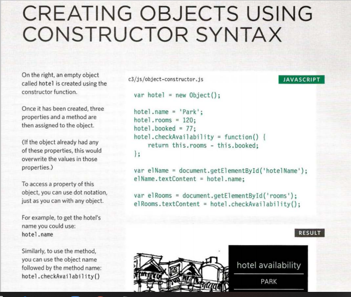

# @ DOMAIN MODELING @
## Domain modeling is the process of creating a conceptual model in code for a specific problem .

### domain model that's articulated well can verify and validate your understanding of that problem .

## To define the same properties between many objects, you'll want to use a constructor function. Below is a table that summarizes a JavaScript representation of an EpicFailVideo object.

# How build your own domain models :

1. When modeling a single entity that'll have many instances, build self-contained objects with the same attributes and behaviors .
2. Model its attributes with a constructor function that defines and initializes properties .
3. Model its behaviors with small methods that focus on doing one job well .
4. Create instances using the new keyword followed by a call to a constructor function .
5. Store the newly created object in a variable so you can access its properties and methods from outside .
6. Use the this variable within methods so you can access the object's properties and methods from inside .

## This is object-oriented programming in JavaScript at its most fundamental level .

## Generate random numbers by ``Math.random()`` .

 

# html table

# Q : What's a Table ?
A: A table represents information in a grid format .

### Examples of tables include financial reports, TV schedules, and sports results .

## Each block in the grid is referred to as a table cell . 
##  a table is written out row by row .

# Basic Table Structure :

1. ``<table>:``
The ``<table>`` element is used to create a table. The contents of the table are written out row by row .
2. ``<tr>:``
You indicate the start of each row using the opening ``<tr>`` tag. (The tr stands for table row .)
It is followed by one or more ``<td>`` elements (one for each cell in that row) . At the end of the row you use a closing ``</tr>`` tag .
3. ``<td>:``
Each cell of a table is represented using a ``<td>`` element. (The td stands for table data .)
At the end of each cell you use a closing ``</td>`` tag .

# table headings : 
1. ``<th>:``
The ``<th>`` element is used just like the ``<td>`` element but its purpose is to represent the heading for either a column or a row . 

## The colspan attribute can be used on a ``<th>`` or ``<td>`` element and indicates how many columns that cell should run across .

## The rowspan attribute can be used on a ``<th>`` or ``<td>`` element to indicate how many rows a cell should span down the table .

# There are three elements that help distinguish between the main content of the table and the first and last rows :
1. ``<thead>:``
The headings of the table should sit inside the ``<thead>`` element . 
2. ``<tbody>:``
The body should sit inside the ``<tbody>`` element .
3. ``<tfoot>:``
The footer belongs inside the ``<tfoot>`` element .

###  ``
`` The width attribute was used on the opening ``<table>`` tag to indicate how wide that table should be and on some opening ``<th>`` and ``<td>`` tags to specify the width of individual cells .

### The value of this attribute is the width of the table or cell in pixels .

### ``
`` The bgcolor attribute was used to indicate background colors of either the entire table or individual table cells,  The value is usually a hex code .

 

# functions ,methods ,and objects 

# you create a new object using a combination of the <b>new</b>keyword and the <b>object()</b>constructor function .

## the <b>curly brackets</b> create an empty object .

### to update the value of proberties , use dot notation or square brackets .

# object constructors can use a function as a template for creating objects .

## you create instances of the object using the constructor function .

# the <b>new</b> keyword followed by a call to the function creates a new object .

# the properties of each object are given as arguments to the function .

## the <b>img</b> below show example of how to create objects using constructor syntax with explanation :

# The keyword this is commonly used inside functions and objects .

## Where the function is declared alters what this means. It always refers to one object, usually the object in which the function operates . 

#  data is represented using name/value pairs .

## To organize your data, you can use an array or object to group a set of related values. In arrays and objects the name is also known as a key . 

# If you want to access items via a property name or key, use an object .

# If the order of the items is important, use an array . 

# Objects created with literal notation are good :
• W hen you are storing I transmitting data between applications
• For global or configuration objects that set up information for the page To access the properties or methods of the object, use dot notation: <b>hotel.name</b>

# Objects created with constructors are good when :
• You have lots of objects used with similar functionality (e.g., multiple slideshows I media players/ game characters) within a page
• A complex object might not be used in code To access the properties or methods of the object, use dot notation: <b>hotel2.name</b>

# ARRAYS are apecial type of object , they hold a related set of key/value pairs , but the key for each value its index number .

## you can combine arrays and objects to create complex data structures :

1. Arrays can store a series of objects .
2. objects can also hold arrays .

 # WHAT DOES THIS SECTION COVER ?
You have already seen how to access the properties
and methods of an object, so the purpose of this
section is to let you know:
• What built-in objects are available to you
• What their main properties and methods do

# Q:  WHAT IS AN OBJECT MODEL ?
You have seen that an object can be used to create a model of something from the real world using data .
## An object model is a group of objects, each of which represent related things from the real world . Together they form a model of something larger . 

## In JavaScript there are six data types :
Five of them are described as simple data types .
The sixth is the object (and is referred to as a complex data type) . 

# SIMPLE OR PRIMITIVE DATA TYPES  JavaScript has five simple (or primitive) data types :
1. String
2. Number
3. Boolean
4. Undefined (a variable that has been declared, but no value has been assigned to it yet )
5. Null (a variable with no value - it may have had one at some point, but no longer has a value ) 

# COMPLEX DATA TYPE JavaScript also defines a complex data type :

<b>Object</b> Under the hood, arrays and functions are considered types of objects .

# JavaScript also has several <b>built-in</b> objects such as String, Number, Math, and Date. Their properties and methods offer functionality that help you write scripts .

## Arrays and objects can be used to create complex data sets (and both can contain the other) . 

