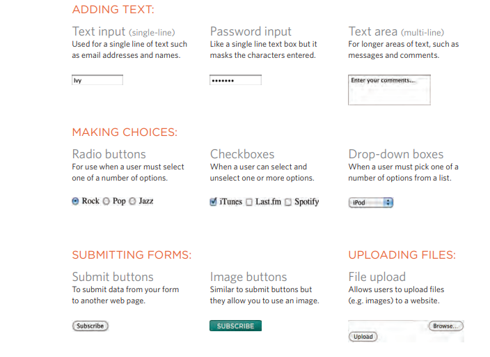
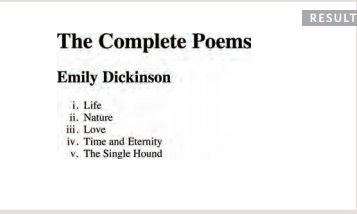
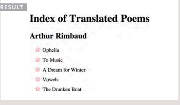
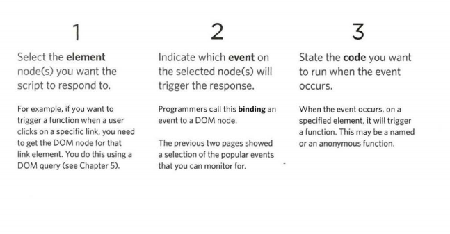
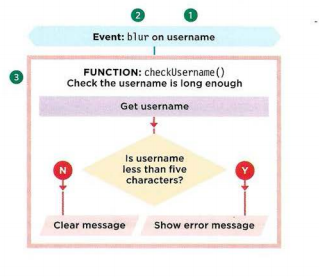

# FORMS 

 ## use  form to refer to different elements that allow you to collect information from visitors to your site .
 
## Information from a form is sent in name/value pars .

### Each form control is given a name, and the text the user types in or the values of the options they select are sent to the serve r.

## below are several types of form controls that you can use to collect information from visitors to your site.

# How Forms Work:
1. A user fills in a form and then presses a button to submit the information to the server.

2. The name of each form control is sent to the server along with the value the user enters or selects.
 
3. The server processes the information using a programming language such as PHP, C#, VB.net, or Java. It may also store the information in a database
   
4. The server creates a new page to send back to the browser based on the information received.

# A form may have several form controls, each gathering different information. 

# The server needs to know which piece of inputted data corresponds with which form element.

## Form Structure :

1.``<form>`` Form controls live inside a ``<form>`` element. 

2. action Every <``form>`` element requires an action attribute.

3. method Forms can be sent using one of two methods: get or post.
   
4. id

# ``<input>`` The ``<input>`` element is used to create several different form controls. 

``type="text"`` When the type attribute has a value of text, it creates a singleline text input
1. name
2. size .
3. maxlength .

# if ypu want te create password input ypu can do that by type="password"

# ``<textarea>``
The ``<textarea>`` element is used to create a mutli-line text input.

# Radio Button :

1. ``type="radio"``
Radio buttons allow users to pick just one of a number of options.
2. name: 
The name attribute is sent to the server with the value of the option the user selects
3. value:
The value attribute indic
4. checked:
The checked attribute can be used to indicate which value.

 

# lists ,tables & forms :

# there are several CSS properties that are specifically used to control the appearance of lists, tables, and forms.

## List markers can be given different appearances using the list-style-type and list-style image properties.

### # Table cells can have different borders and spacing in different browsers, but there are properties you can use to control them and make them more consistent.

# EVENTS :

# Events are the browser's way of indicating when something has happened .

# Binding is the process of stating which event you are waiting to happen, and which element you are waiting for that event to happen upon. 

# TERMINOLOGY:

1. EVENTS FIRE OR ARE RAISED:
When an event has occurred, it is often described as having fired or been raised. In the diagram on the right, if the user is tapping on a link, a click event would fire in the browser.

2. EVENTS TRIGGER SCRIPTS:
Events are said to trigger a function or script. When the click event fires on the element in this diagram, it could trigger a script that enlarges the selected item. 

## You can use event delegation to monitor for events that happen on all of the children of an element. 

# HOW EVENTS TRIGGER JAVASCRIPT CODE:

