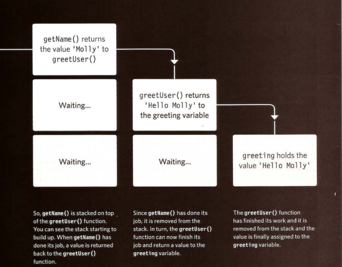
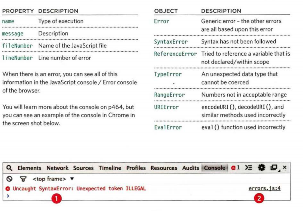

# Error Handling & Debugging :

## EXECUTION CONTEXT JavaScript : Every statement in a script lives in one of three execution contexts .

# # EXECUT.ION CONTEXTS:

1. GLOBAL CONTEXT:
Code that is in the script, but not in a function. There is only one global context in any page .
2. FUNCTION CONTEXT:
Code that is being run within a function. Each function has its own function context .
3. EVAL CONTEXT:
Text is executed like code in an internal function called eval () .

### #JavaScript has 7 different types of errors. Each creates its own error object, which can tell you its line number and gives a description of the error .

# VARIABLE SCOPE:  The first two execution contexts correspond with the notion of scope :

1. GLOBAL SCOPE: 
If a variable is declared outside a function, it can be used anywhere because it has global scope. If you do not use the var keyword when creating a variable, it is placed in global scope .
2. FUNCTION-LEVEL SCOPE:
When a variable is declared within a function, it can only be used within that function. This is because it has function-level scope . 

# Each time a script enters a new execution context, there are two phases of activity :

1. PREPARE
• The new scope is created
• Variables, functions, and arguments are created
• The value of the this keyword is determined

2. EXECUTE
• Now it can assign values to variables
• Reference functions and run their code
• Execute statements

## Error objects can help you find where your mistakes are and browsers have tools to help you read them . 

# HOW TO DEAL WITH ERRORS :

1: DEBUG THE SCRIPT TO FIX ERRORS:
If you come across an error while writing a script (or when someone reports a bug), you will need to debug the code, track down the source of the error, and fix it . 
2: HANDLE ERRORS GRACEFULLY:
You can handle errors gracefully using try, catch, throw, and f i na 1 ly statements . 

## using the try, catch, finally statements. Use them to give your users helpful feedback . 

