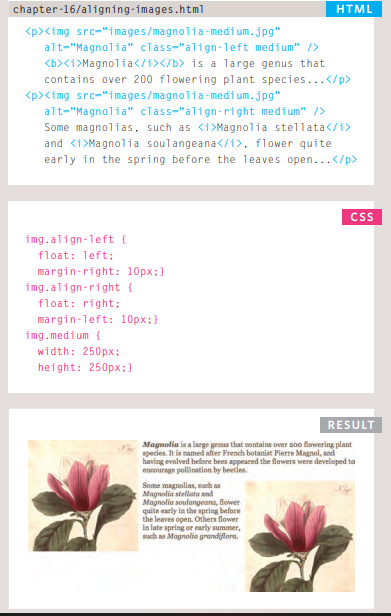
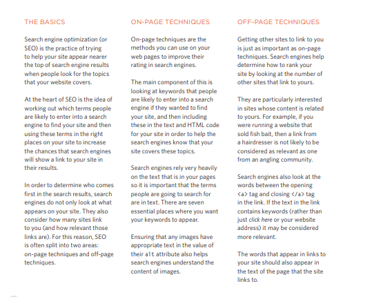
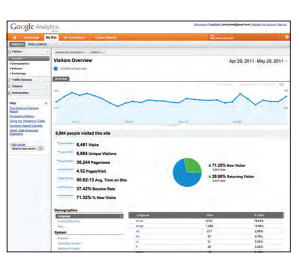
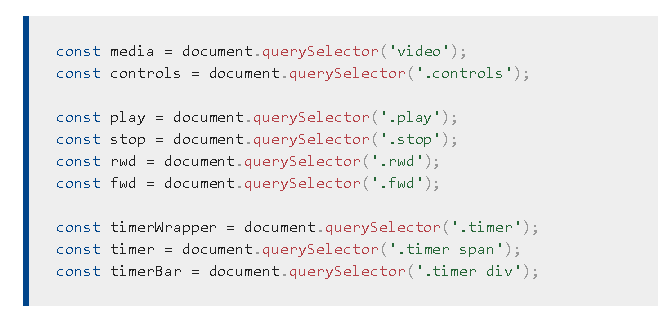

# images

## You can specify the dimensions of images using CSS. 

### You can control the size of an image using the width and height properties in CSS.

# Images can be aligned both horizontally and vertically using CSS.

# Where the  elements appear in the HTML, rather than using width and height attributes you can use these names as values for the class attribute. 

# In the CSS, you add selectors for each of the class names, then use the CSS width and height properties to control the image dimensions.

# There are two ways that this is commonly achieved:

1. The float property is added to the class that was created to represent the size of the image.
2. New classes are created with names such as align-left or align-right to align the images to the left or right of the page.
   
### These class names are used in addition to classes that indicate the size of the image.
   
# there are two common ways in which you can horizontally center an image:

1. On the containing element, you can use the text-align property with a value of center.
2. On the image itself, you can use the use the margin property and set the values of the left and right margins to auto.
   

# The background-repeat property can have four values:

1. repeat:
The background image is repeated both horizontally and vertically.
2. repeat-x:
The image is repeated horizontally only .
3. repeat-y:
The image is repeated vertically only.
4. no-repeat:
The image is only shown once.   

## To reduce the number of images your browser has to load, you can create image sprites.

# Practical Information

# Search Engine Optimization (SEO)

## Search engine optimization helps visitors find your sites when using search engines.

#  key concepts:

### Analytics tools such as Google Analytics allow you to see how many people visit your site, how they find it, and what they do when they get there.

# Analytics: Learning about your Visitors:
1. Signing Up:
The Google Analytics service relies on you signing up .
2. How it Works:
Every time someone loads a page of your site .
3. The Tracking Code:
A tracking code is provided by Google Analytics for each website you are tracking. 

## #How Many People Are Coming to Your Site ?

# Domain Names & Hosting :

# DOMAIN NAMES WEB HOSTING:

Your domain name is your web
address.

# FTP programs allow you to transfer files from your local computer to your web server.

# Many companies provide platforms for blogging, email newsletters, e-commerce and other popular website tools.

# Video and Audio APIs :

# The ``<video>`` and ``<audio>`` elements allow us to embed video and audio into web pages. 

# Implementing the JavaScript We've got a fairly complete HTML and CSS interface already; now we just need to wire up all the buttons to get the controls working.

### Create a new JavaScript file in the same directory level as your index.html file. Call it custom-player.js.

### At the top of this file, insert the following code:

