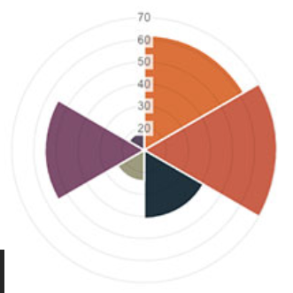
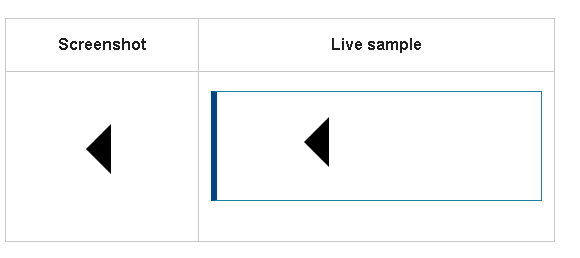
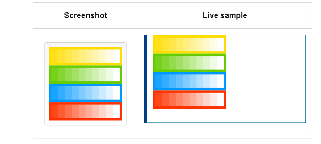
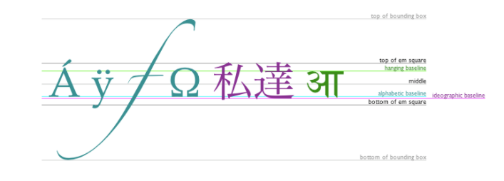

# Charts are far better for displaying data visually

# a JavaScript plugin that uses HTML5’s canvas element to draw the graph onto the page. 

# To create a chart :

1. Setting up : do is download Chart.js, and import the script,create a canvas element in our HTML in which Chart.js can draw our chart.
2. Drawing a line chart :write a script that will retrieve the context of the canvas, the same script tags we need to create our data.
3.  Drawing a pie chart.

# License: Chart.js is available under the MIT license.

#  the ``<canvas>`` element has only two attributes, width and height. 

## The ``<canvas>`` element has a method called ``getContext()``, used to obtain the rendering context and its drawing functions,``getContext()`` takes one parameter, the type of context. For 2D graphics.

### A path is a list of points, connected by segments of lines that can be of different shapes, curved or not, of different width and of different color. 

## to make shapes using paths, we take some extra steps:

1. you create the path by using function ``beginPath()``.
2. use drawing commands to draw into the path.
3. you can stroke or fill the path to render it.

# If we want to apply colors to a shape, there are two important properties we can use: 

1. fillStyle = color
Sets the style used when filling shapes
2. strokeStyle = color
Sets the style for shapes' outlines.

# Line styles : There are several properties which allow us to style lines:

1. lineWidth = value
Sets the width of lines drawn in the future.
2. lineCap = type
Sets the appearance of the ends of lines.
3. lineJoin = type
Sets the appearance of the "corners" where lines meet.
4. miterLimit = value
Establishes a limit on the miter when two lines join at a sharp angle, to let you control how thick the junction becomes.

# The canvas rendering context provides two methods to render text:

1. fillText``(text, x, y [, maxWidth])``:
Fills a given text at the given (x,y) position. Optionally with a maximum width to draw.
2. strokeText``(text, x, y [, maxWidth])``:
Strokes a given text at the given (x,y) position. Optionally with a maximum width to draw.

# There are some more properties which let you adjust the way the text gets displayed on the canvas:
1. font = value
2. textAlign = value
3. textBaseline = value
4. direction = value

